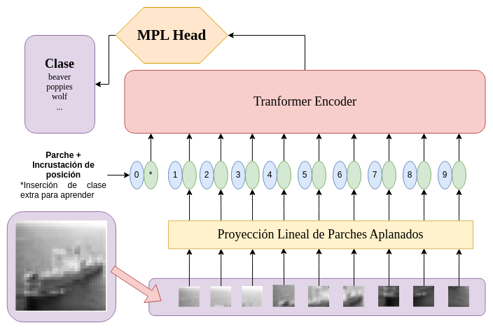
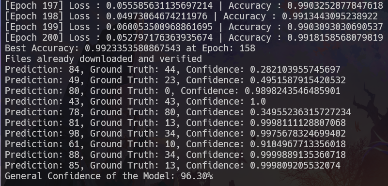
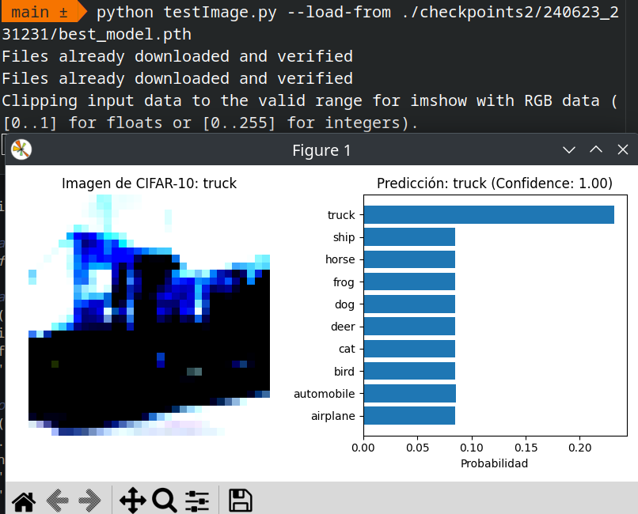
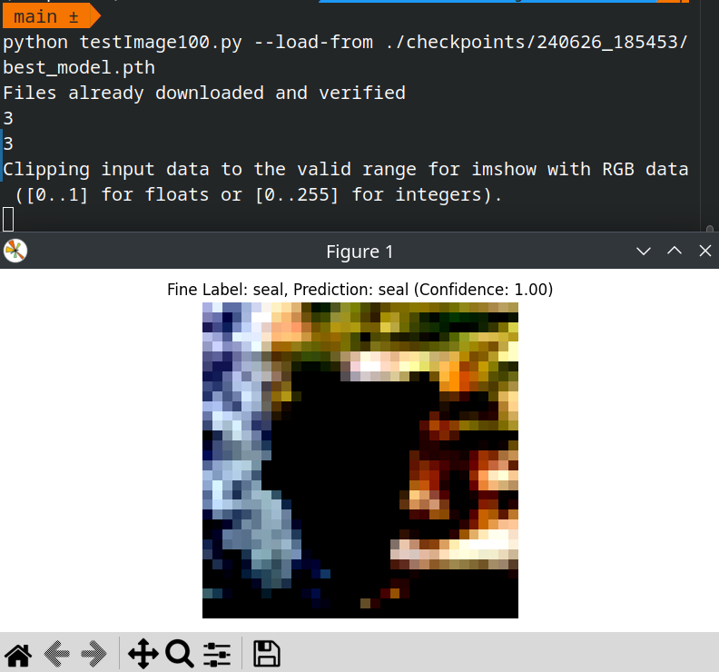
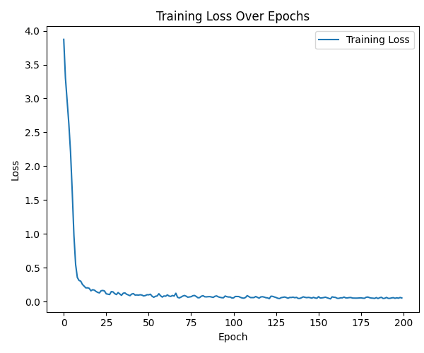
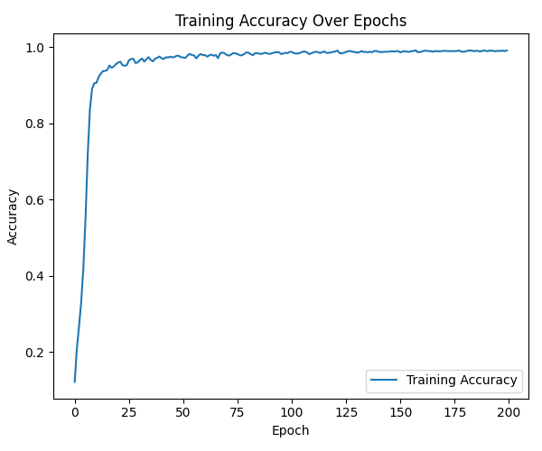
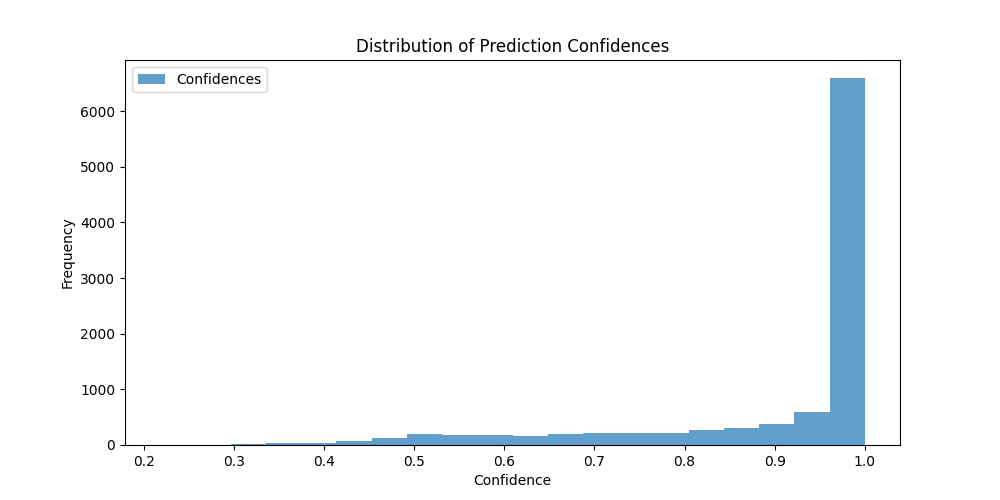

# ViT-CI: Vision Transformer de Escala Única para Clasificación de Imágenes de Baja Calidad

<div style="text-align: center;">


</div>

By @ShinjiMC - Braulio Nayap Maldonado Casilla

La clasificación de imágenes presenta desafíos significativos en visión por computadora, especialmente con imágenes de baja resolución que carecen de detalles cruciales para una clasificación precisa. Este problema es más complejo en aplicaciones como sistemas de vigilancia, donde la calidad limitada de los datos visuales implica la necesidad crítica de maximizar la información disponible. Para abordar esto, se propone el modelo ViT-CI, una variante optimizada de Vision Transformer diseñada para manejar imágenes de baja resolución, utilizando como referencia el conjunto de datos CIFAR-100. Esta investigación ha demostrado experimentalmente una eficiencia de clasificación del 42.67\%, superando en rendimiento a métodos que requieren procesos adicionales de super-resolución con mayores recursos computacionales. Se espera que estos resultados preliminares subrayen la viabilidad y eficacia del ViT-CI en aplicaciones prácticas del mundo real.



## Configurar el Entorno con Anaconda

1. **Instalar Anaconda:**
   Si no tienes Anaconda instalado, sigue estos pasos:

   - Descarga Anaconda desde [el sitio web de Anaconda](https://www.anaconda.com/products/distribution).
   - Sigue las instrucciones de instalación para tu sistema operativo.

2. **Crear y Activar el Entorno:**
   Abre una terminal y ejecuta los siguientes comandos:
   ```bash
   conda create --name vitci python=3.8
   conda activate vitci
   ```

## Instalación de Dependencias

Para comenzar, clona el repositorio de ViT-CI desde GitHub. Abre una terminal y ejecuta los siguientes comandos:

```bash
git clone https://github.com/ShinjiMC/ViT-CI
cd ViT-CI
```

Una vez clonado el repositorio, procede a instalar las dependencias necesarias. Es recomendable crear un entorno virtual con Anaconda antes de instalar las bibliotecas Python. A continuación, se detallan los pasos para instalar las dependencias requeridas:

1. **Instalación de PyTorch y sus dependencias:**

   ```bash
    pip install torch==1.8.0 torchvision==0.9.0 torchaudio==0.8.0 --extra-index-url https://download.pytorch.org/whl/cu111
   ```

   Asegúrate de instalar la versión específica de PyTorch que sea compatible con tu configuración de CUDA si estás utilizando GPU.

2. **Instalación de otras dependencias:**

   ```bash
    pip install pyyaml six matplotlib tensorboard
   ```

   Estas bibliotecas son necesarias para manejar archivos de configuración YAML, operaciones básicas en Python, visualización de datos con Matplotlib y registro de métricas con TensorBoard.

## Entrenar tu Propio Modelo

Para entrenar tu modelo ViT-CI con el conjunto de datos CIFAR-10 o CIFAR-100, sigue estos pasos:

1. **Dataset CIFAR-10:**

   ```bash
   python main.py --dataset-name cifar10 --classes-num 10 --device cuda --epoch 200 --batch-size 128 --patch-size 16 --embedding-size 768 --encoder-blocks-num 12 --heads-num 12
   ```

2. **Dataset CIFAR-100:**
   ```bash
   python main.py --dataset-name cifar100 --classes-num 100 --device cuda --epoch 200 --batch-size 128 --patch-size 16 --embedding-size 768 --encoder-blocks-num 12 --heads-num 12
   ```

Asegúrate de tener configurada una GPU compatible con CUDA para acelerar el entrenamiento. Ajusta los parámetros según tus necesidades de experimentación, como el tamaño del lote (`--batch-size`), el tamaño del parche (`--patch-size`), el tamaño del embedding (`--embedding-size`), y el número de bloques del codificador (`--encoder-blocks-num`) y cabezas de atención (`--heads-num`).

### Ejemplo de Entrenamiento de ViT-CI en CIFAR-100



En la imagen anterior, se muestra un ejemplo visual del proceso de entrenamiento de ViT-CI en el dataset CIFAR-100. Asegúrate de monitorear el progreso del entrenamiento y ajustar los hiperparámetros según los resultados obtenidos en cada iteración.

## Testea tu Modelo

Para evaluar el rendimiento de tu modelo entrenado ViT-CI en los conjuntos de datos CIFAR-10 y CIFAR-100, sigue estos pasos:

1. **Prueba con CIFAR-10:**

   ```bash
   python testImage.py --load-from ./checkpoints/DIR/best_model.pth
   ```

   

   En la imagen anterior, se ilustra un ejemplo de prueba del modelo en el conjunto de datos CIFAR-10. Asegúrate de analizar las métricas de rendimiento y la precisión alcanzada por el modelo entrenado.

2. **Prueba con CIFAR-100:**

   ```bash
   python testImage100.py --load-from ./checkpoints/DIR/best_model.pth
   ```

   

   En esta segunda imagen, se muestra el proceso de evaluación del modelo en el conjunto de datos CIFAR-100. Observa cómo el modelo se comporta frente a las diferentes clases de imágenes y verifica su capacidad para generalizar en un conjunto de datos más diverso.

Asegúrate de haber entrenado previamente tu modelo con los conjuntos de datos correspondientes y de haber seleccionado el mejor modelo guardado (`best_model.pth`) para realizar estas pruebas.

## Resultados

Se entrenó el modelo durante 200 épocas utilizando el conjunto de datos CIFAR-100, generando dos tipos de gráficos para evaluar su rendimiento. La pérdida durante el entrenamiento, mostrada en la Figura 1, indica cómo la pérdida del modelo evolucionó a lo largo del proceso. Durante las primeras 10 a 20 épocas, se observó un punto donde la pérdida comenzó a estabilizarse, indicando una adaptación inicial del modelo a los datos.



Por otro lado, la precisión durante el entrenamiento, ilustrada en la Figura 2, revela cómo la precisión del modelo en el conjunto de entrenamiento aumentó gradualmente. Se identificó un punto de mejora entre las 15 y 25 épocas, sugiriendo adaptaciones significativas del modelo a los datos de entrenamiento.



Al finalizar el entrenamiento, los resultados mostraron una pérdida final de **0.04973** y una precisión final de **0.992335**, validando la efectividad del modelo entrenado en el conjunto de datos CIFAR-100.



El gráfico de la distribución de confianzas de las predicciones muestra que la mayoría de las predicciones (más de 6000 muestras) tienen una confianza muy alta, concentrándose principalmente en el intervalo de 0.97 a 1. Predicciones con confianzas menores a 0.97 son menos frecuentes, totalizando menos de 1000 muestras en total. Este patrón revela que el modelo tiende a estar altamente seguro en la mayoría de sus predicciones, con pocas excepciones donde la confianza es moderada o baja.

## Conclusiones

En este estudio, se ha propuesto el uso de un Vision Transformer (ViT-CI) para la clasificación de imágenes de baja resolución, representando un avance significativo en la capacidad de los transformers para manejar imágenes con limitaciones de calidad visual. El ViT-CI adaptado para estas imágenes mostró una eficiencia del 42.67% en la clasificación precisa, superando las limitaciones históricas de las CNN en condiciones similares. Este modelo no solo mejora la eficiencia de sistemas de videovigilancia, sino que también establece un estándar para la interpretación confiable de imágenes de baja calidad visual. Los resultados preliminares subrayan la viabilidad del ViT-CI en aplicaciones prácticas donde la calidad visual es crítica, abriendo nuevas vías de investigación en el diseño y entrenamiento de modelos transformers adaptados a estas condiciones específicas.

## License:

This project is licensed under [Creative Commons Atribución-NoComercial-CompartirIgual 4.0 Internacional](http://creativecommons.org/licenses/by-nc-sa/4.0/):

<a rel="license" href="http://creativecommons.org/licenses/by-nc-sa/4.0/">
  
</a>
